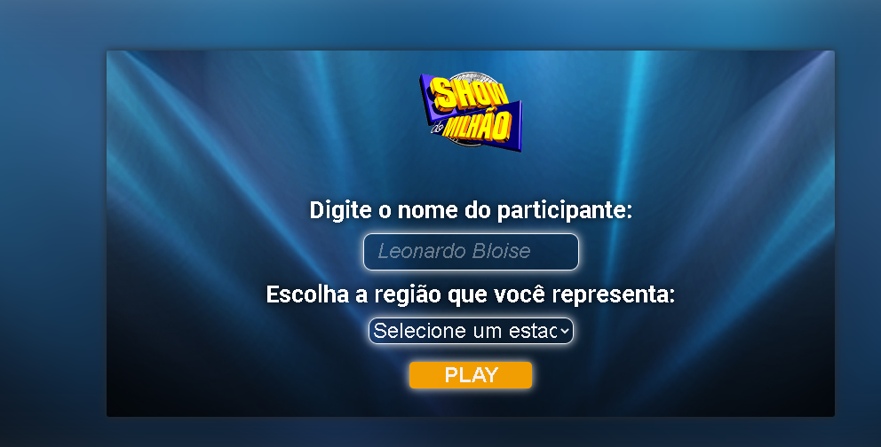

# Show do Milhão

Esse projeto foi feito como parte do desafio técnico realizado pelo processo seletivo da Jovem Gênios. Contudo, esse desafio fez com que eu me esforçasse e produzisse um dos maiores produtos que eu tenho atualmente. Logo, estarei disponibilizando ele aqui permanentemente.

## Tecnologias utilizadas

- Javascript
- HTML5
- CSS3

### Ideia:

O jogo foi completamente inspirado na primeira versão do Show do Milhão, onde você tinha 5 perguntas que valiam um determinado valor. Depois disso, o jogo irá avançar e levará você para mais 5 perguntas que valem uma quantia maior ainda. Depois de 15 perguntas, você irá responder a décima sexta pergunta, que vale um milhão. Além disso, você será guiado pelo som, onde a cada acerto, erro e aumento de nível possui um som diferente. 

Atualmente, o jogo consta somente com 15 perguntas e 1 pergunta de 1 milhão de reais. Contudo, ele foi projetado para receber mais perguntas em sua base de dados e, a partir delas, gerar uma lista de 5 questões de acordo com o nível.

Para ter mais informações, acesse o vídeo abaixo:

[Clique aqui para acessar o vídeo](https://www.youtube.com/watch?v=YjwaWWsNdP4)